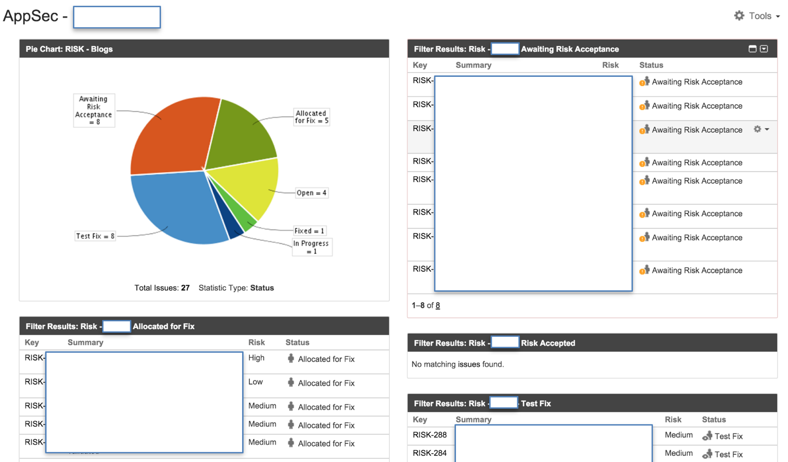
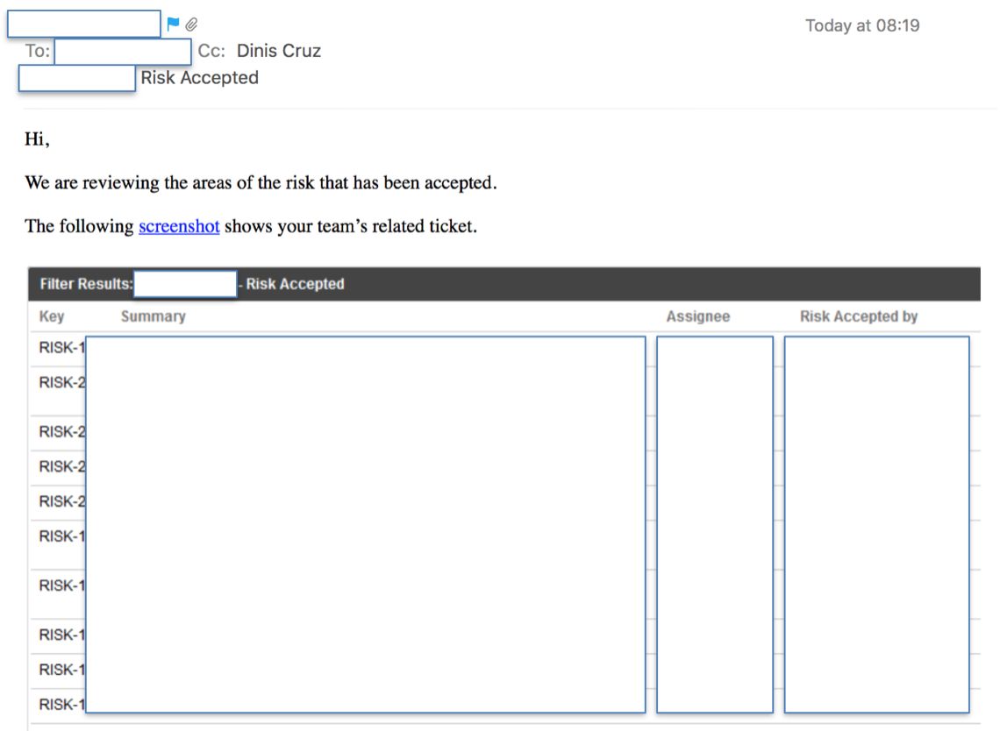

### Risk Dashboards and emails

{width=50%, float=right}

It is critical that you create a suite of management dashboards that map the existing security metrics and the status of RISK tickets:

  * _Open, In Progress_
  * _Awaiting Risk Acceptance, Risk Accepted_
  * _Risk Approved, Risk not Approved, Risk Expired_
  * _Allocated for Fix, Fixing, Test Fix_
  * _Fixed_

Visualising this data makes it real and creates  powerful dashboards. These need to be provided to all players in the software development lifecycle.

You should create a sequence of dashboards that starts with the developer (mapping the issues that he is responsible for), then his technical architect, then the business owner, the product owner ... all the way to the CTO and CISO.

Each dashboard makes it clear which risks they are responsible for, and the current status of application security for those particular applications/projects.

To reenforce ownership and make sure the issues/risks don't 'disappear', the solution is to use either the full dashboard, or specific tables/graphs, to create emails that are sent regularly to their respective owner.

{width=50%, float=right}

The power of risk acceptance is that each layer is accepting risk on behalf of the layer above. Which means that the higher one is the company structure, the more risks are allocated and accepted (all the way to the CISO and CTO).

The CISO plays a big part in this workflow, since it is his job to approve all 'Risk Accepted' issues (or raise exceptions that need to approved by higher management).

This workflow drives a large number of security activities because each player is motivated to to act on his best interest (which is to reduce the number of allocated Risk Accepted items)

The idea is to social-engineer the management layer into asking the developers to do the non-function-requirements tasks that they know are important, but are seldom given the time to do.
