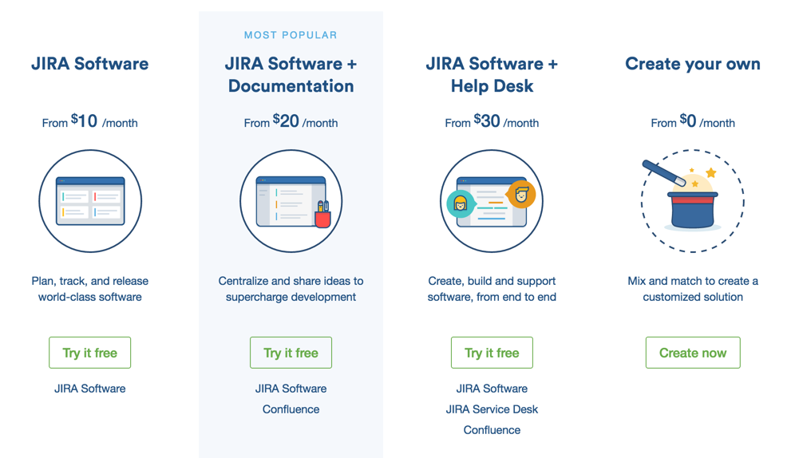
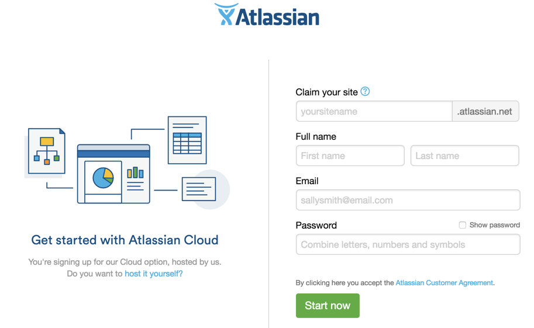
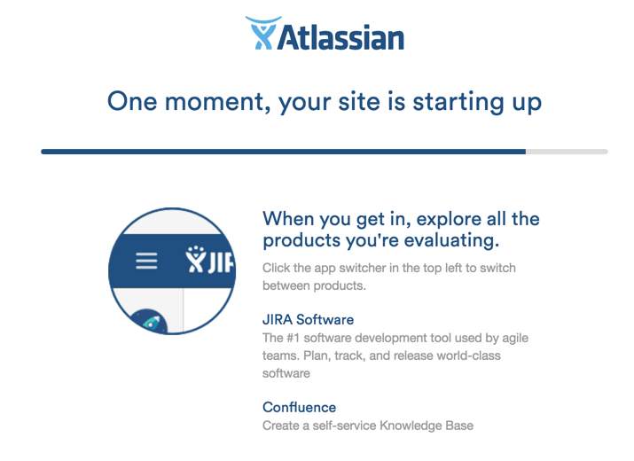
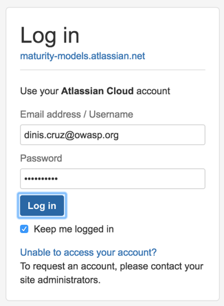
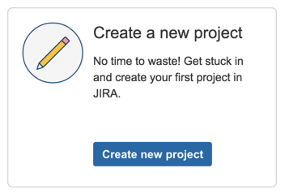
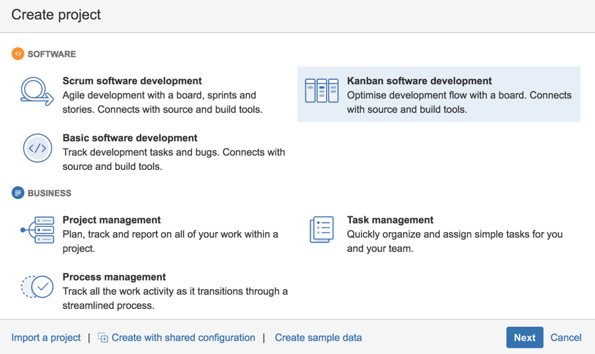
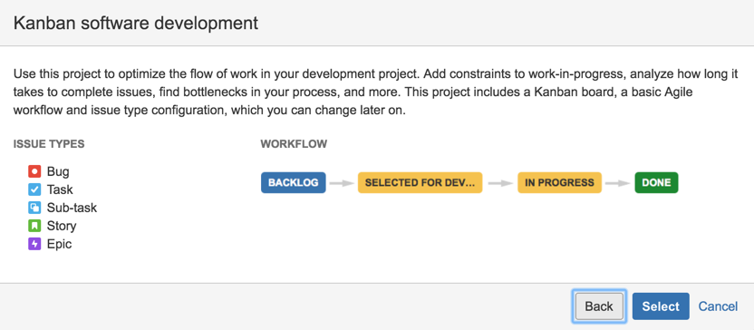
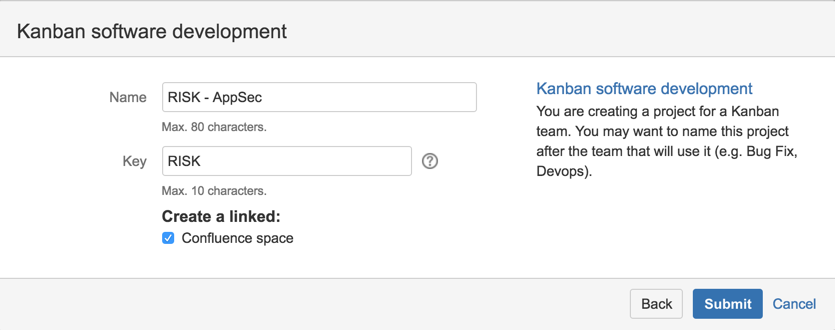
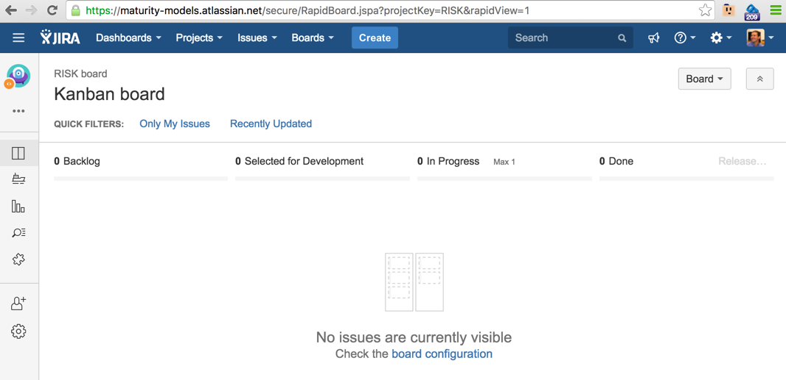

### Creating-a-Jira-project

For these examples we will use the version hosted JIRA cloud called (in Oct 2016) JIRA Software.

Note that the same workflow can be created on the on-premise versions of JIRA (including the older versions)

{width=50%, float=right}

First step is to go to https://www.atlassian.com/software/jira/try  and chose the _JIRA Software_. I would also add in the _Documentation_ (aka Confluence) module since it is a very powerfull wiki (which is  called _Confluence_)

---

{width=50%, float=right}

If you don't have an account you will need to create one.

---

After clicking on _Start now_ your cloud instance of JIRA will be created (my bet is that this is a docker container with a dedicated data store for each customer/trial)

{width=50%, float=right}

3) login

{width=50%, float=right}

4) create new project

{width=50%, float=right}

{float=left}
5) choose Kanban Software Development

{width=50%}

{width=50%}

6) Name it 'RISK - AppSec' with the key 'RISK',

{width=50%}

{width=50%}

